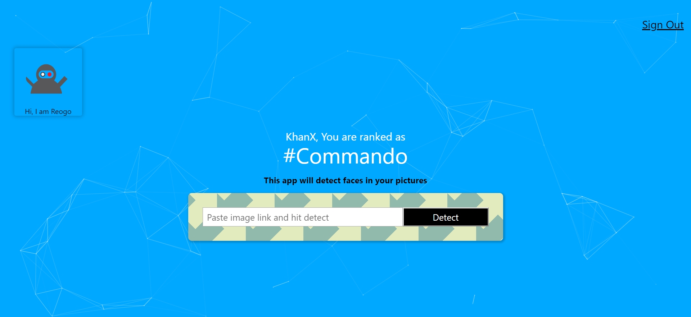

Face-Detection React APP

## What its Does:
This App is built in React which can detects faces in the photos using Clarifai Api

## Technologies Used:
HTML5, CSS3, JavaScript ES6, React, NPM, Git, Clarifai API

Demo:

Process:
<ol>
<li>First I made a sketch on paper of what i needed</li>
<li>break it down into  views into components</li>
  <li>Once the basic view is established, I moved down into adding functionalities</li>
<li>creating states for input value, input field</li>
  <li>Register account on Clarifai to get API key. then console the response to figure out the data that I needed to display detection on photo</li>
  <li>Now that i have the data from console now the target is to display display the rectangle on the photo </li>
  <li>I created another function calculateFaceLocation where I am getting the dimension of the inserted image and resulted dots from api and return an object with calculation connected with dimension and then passing down that box as props into the FaceRecognition component to display.</li>
  <li>Now build the basic routing as to what happens what a certain button is clicked / signin/register/singout </li>
  <li>Thank you</li>

</ol>

## Screenshots

the api has many different models, I also tested the food ingredients testing model

